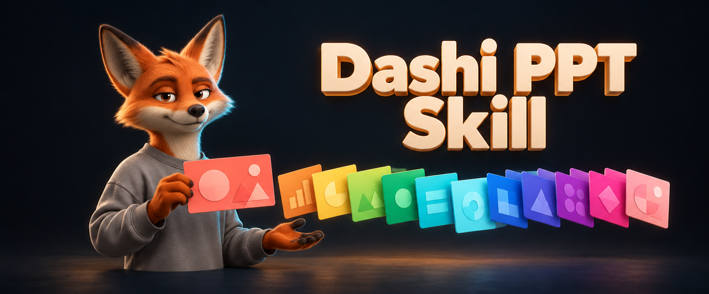
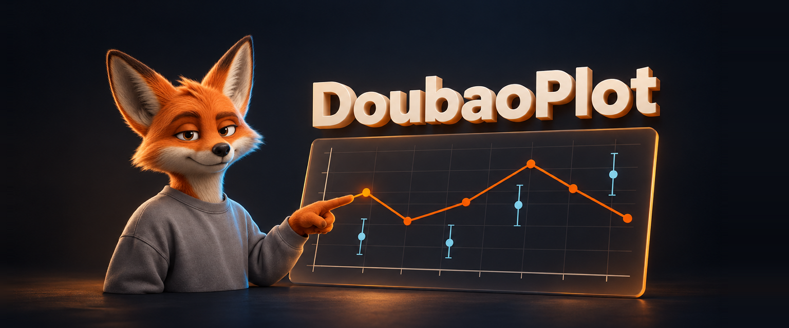

# 大师

我做「大师的AI小灶」，一个讲 AI 怎么用的内容账号。
讲着讲着，顺手把用到的工具开源了：一个 PPT skill 8k+ star，一个任务看板 3k+ star。
我不是程序员。产品是 AI 写的，我负责想清楚要做什么、判断做得对不对。

## 产品

### Dashi PPT Skill
把文档丢给 AI Agent，出一份每页自带编辑控制台的 PPT。不满意的地方直接在浏览器里改，改完一键导出真实可编辑的 PPTX。
12 套视觉主题、1020 个版式页面、8576 个可调控件。支持 Claude Code、Codex、豆包等 8 个平台。

### Codex Taskboard
本地优先的任务看板。人在看板上建单，Codex 自己捞单执行，改完挪到待验收。
浏览器里能跑，也能嵌进 Codex。有 macOS 和 Windows 安装包，同一套接口驱动网页界面和 taskctl 命令行，还支持 DeepSeek Harness。

### dashi-motion
让 AI 在 After Effects、Rive、Cavalry 里做能继续编辑的动效。
整理了三款软件的执行步骤、控制方式、失败现象和处理结果，附 3 个验证过的脚本。交付的是可编辑的 .aep、.cv 和 Rive 状态机，不是一段渲染好的视频。

### DoubaoPlot
在豆包工作里用 Origin 画可编辑的科研图，也支持 Codex 和 Claude Code。
基于 hang-jin/editaplot 二次创作，加了 45 种图可点选的选择器。Windows 10/11，Origin 2021 到 2026b。

## 找到我

[抖音](https://www.douyin.com/user/MS4wLjABAAAAohe8JB4RvITJitJ69b7cV4NTaYTMYrVI43C-3SUnPPc) · [小红书](https://www.xiaohongshu.com/user/profile/62e0c2bb000000001501408c) · [B站](https://space.bilibili.com/3537118131391269) · [X](https://x.com/Chuspeeism) · [YouTube](https://www.youtube.com/@dashiAI) · 视频号「大师的AI小灶」
